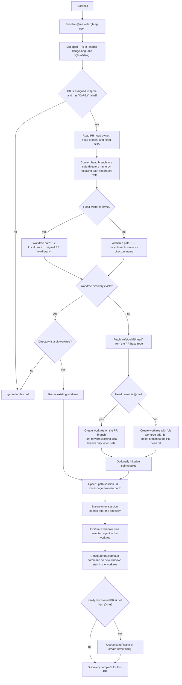
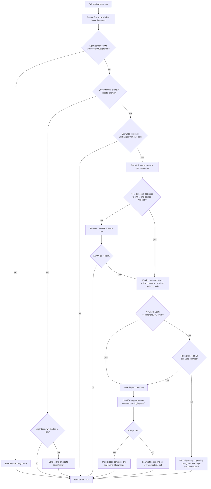

# agent-review.py

`extras/agent-review.py` is a long-running local watcher for CoPilot-labeled pull requests
assigned to the authenticated GitHub user. It discovers matching PRs in `shader-slang/slang`
and `@me/slang`, creates or reuses sibling worktrees, starts one tmux session per worktree, and
sends review-maintenance prompts to the agent running in the first tmux window.

Keep the Mermaid flows in this document updated as the primary behavior contract whenever the
script behavior changes.

## Usage

```bash
extras/agent-review.py --agent codex
extras/agent-review.py --agent claude
extras/agent-review.py --once --dry-run --no-submodules
```

The script must be run from inside a Slang git worktree. It resolves the repository root and
creates new worktrees as siblings of that root.

The GitHub CLI must already be authenticated. On native Linux it uses `gh` and `git`. Under WSL it
defaults to `gh.exe` and `git.exe` and converts path arguments for Windows-hosted Git.

## State

The public tracking file is:

```text
~/.cache/agent-review/agent-review.conf
```

Each non-comment row has this format:

```text
path tmux-session-name url [url ...]
```

Example:

```text
/home/shadeform/git/issue-11500 issue-11500 https://github.com/jkwak-work/slang/pull/251 https://github.com/shader-slang/slang/pull/11546
```

URLs are last because one worktree/session can correspond to more than one PR URL, such as an
upstream PR and a fork PR for the same branch. The script keeps derived state beside the config
file using hashed filenames for seen comments, CI signatures, queued initial prompts, and tmux idle
signatures.

## Discovery Flow



`<prefix>` defaults to `$` for Codex and `/` for Claude. Override it with
`AGENT_SKILL_PREFIX` if the agent CLI changes.

## Monitor Flow



The idle check is intentionally conservative: a pane is idle only after the captured screen matches
the previous poll. This avoids sending a new task while the agent is still streaming or editing.

## Configuration

Command-line options:

```text
--agent {codex,claude}      Agent CLI to start in tmux. Defaults to codex.
--agent-flags TEXT          Extra flags appended to the agent launch command.
--repo OWNER/REPO           Repository to scan. Repeatable. Overrides the default repo pair.
--label LABEL               Label to require. Defaults to CoPilot.
--limit N                   PR discovery limit per repository. Defaults to 100.
--poll-seconds N            Quiet polling interval. Defaults to 60.
--state-dir PATH            State directory. Defaults to ~/.cache/agent-review.
--once                      Run one poll and exit.
--dry-run                   Discover and print planned state without writing files or starting tmux.
--no-submodules             Skip submodule initialization for new worktrees.
```

Environment overrides:

```text
GH_COMMAND                  GitHub CLI command.
GIT_COMMAND                 Git command.
AGENT_COMMAND               Agent command, normally codex or claude.
AGENT_FLAGS                 Extra flags for the agent command.
AGENT_SKILL_PREFIX          Prefix before skill names.
AGENT_READY_PATTERN         Regex for agent readiness detection.
AGENT_APPROVAL_PATTERN      Regex for permission/trust prompts.
AGENT_SHELL_COMMAND_PATTERN Regex for shell commands that may be replaced by an agent.
POLL_SECONDS                Quiet poll interval.
POLL_ACTIVE_SECONDS         Poll interval while an agent is active.
POLL_ACTION_SECONDS         Poll interval after sending input.
BOOTSTRAP_MODE              `prime` or `trigger` for existing comments. Defaults to prime.
CI_BOOTSTRAP_MODE           `prime` or `trigger` for existing CI failures. Defaults to BOOTSTRAP_MODE.
WATCH_CI                   Set to false to ignore CI checks.
INIT_SUBMODULES             Set to false to skip submodule initialization.
COPILOT_LABEL               Label to require. Defaults to CoPilot.
DISCOVERY_LIMIT             PR discovery limit per repository.
STATE_DIR                   State directory.
```

## Notes

For branch names containing `/`, the worktree directory replaces separators with `-`; the local
branch for PRs owned by `@me` remains the original PR branch name. For PRs not owned by `@me`, the
directory name gets the `-<me>` suffix and the local branch name is the same as the directory name.

The script never deletes worktrees or tmux sessions. Closed, unassigned, or unlabeled PR URLs are
removed from `agent-review.conf`, but the local checkout is left for manual inspection.
