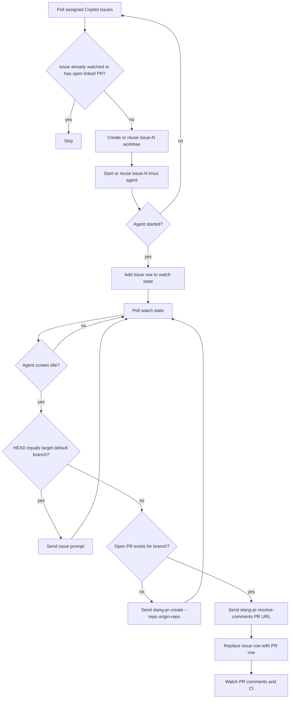
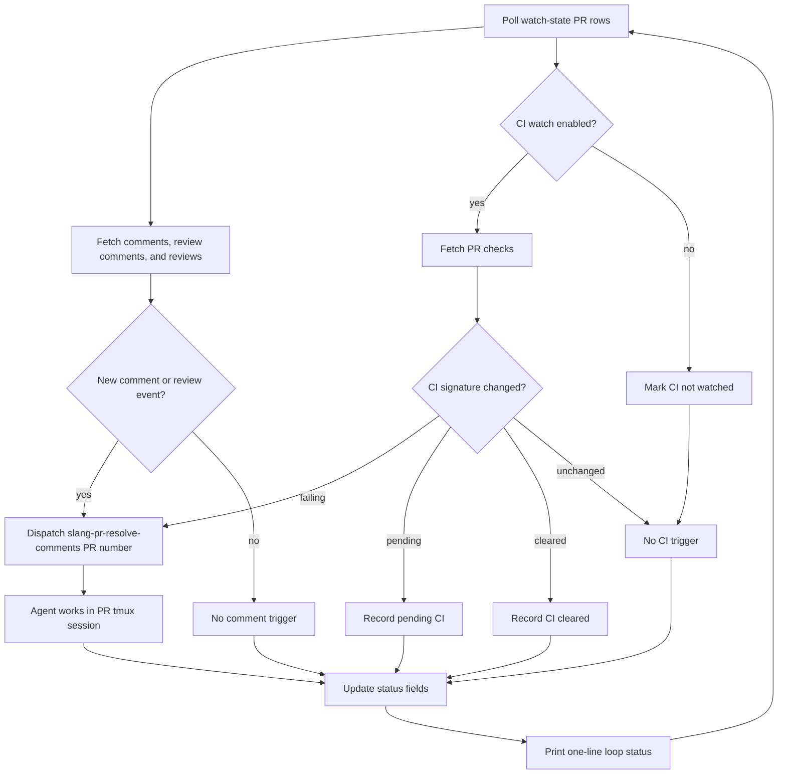

# watch-github.sh

`watch-github.sh` watches GitHub PR comments, reviews, and CI checks for PRs listed in its
internal state file. When a new comment or review appears, or CI starts failing, it starts or
reuses a tmux session rooted in the PR worktree and sends:

```text
<skill-prefix>slang-pr-resolve-comments <PR_NUMBER>
```

The watch list is internal state managed by the surrounding workflow. It is read from
`STATE_DIR/watch-github.conf`; this document intentionally does not define that file format as a
public interface.

The watcher also discovers open issues in the configured issue repository that are assigned to
`@me`, have the `Copilot` label, and do not already have an open linked or closing PR. Closed
linked PRs are ignored for discovery. For each new issue it creates `issue-N` with
`extras/git-worktree-add.sh --issue N issue-N`, starts a tmux session named `issue-N`, and starts
the selected agent in that worktree. The issue is added to watch state only after the agent starts
successfully, so setup failures retry from issue discovery on the next poll. If an `issue-N`
worktree already exists, discovery skips worktree creation; if an `issue-N` tmux session already
exists from a partial setup, discovery resumes that session instead of starting over.

For issue rows, the watcher treats the agent as idle when the captured pane screen repeats across
polling checks. When the agent is idle, it compares the worktree HEAD with the target
repository default branch. If they match, it sends the initial issue prompt. If the worktree has a
new commit and there is no open PR for the branch on the target repository, it sends
`slang-pr-create --repo <origin-repo>`. If there is already an open PR for the branch, it sends
`slang-pr-resolve-comments <PR URL>` and replaces the issue row with the PR URL.

## Issue State Flow



## PR State Flow



## Usage

```bash
extras/watch-github.sh [--agent [claude|codex]] [--once] [--status-issue URL]
```

Options:

- `--agent [claude|codex]`: select the agent to run in tmux. Defaults to `codex`.
- `--once`: run one polling pass and exit.
- `--status-issue URL`: update a GitHub issue with watcher status once per polling pass. The URL
  must look like `https://github.com/OWNER/REPO/issues/NUMBER`.

## Agent Configuration

The watcher runs an interactive agent CLI inside tmux. The `--agent` command-line option selects
the agent for a run. Supported values are `codex` and `claude`; `AGENT_COMMAND` provides the same
value through the environment. New tmux sessions and agent windows start with the agent launch
command as the tmux command itself, so a successful setup must leave a live agent process in the
pane. The watcher sends the issue prompt after readiness detection instead of passing it on the
agent command line; it waits until the agent's idle input prompt is visible before sending.

- `AGENT_COMMAND`: agent command to start. Defaults to `codex`. Use `AGENT_COMMAND=claude` for
  Claude Code.
- `AGENT_FLAGS`: flags appended when starting the agent. Defaults depend on `AGENT_COMMAND`:
  Codex uses `--dangerously-bypass-approvals-and-sandbox`; Claude uses
  `--dangerously-skip-permissions`.
- `AGENT_SKILL_PREFIX`: prefix before agent skills such as `slang-pr-resolve-comments` and
  `slang-pr-create`. Defaults to `$` for Codex and `/` for Claude.
- `AGENT_WINDOW_NAME`: tmux window name for the agent. Defaults to the command name.
- `AGENT_READY_PATTERN`: extended regex used to detect that the agent has started. Readiness also
  requires the tmux pane's current command to be a non-shell process.
- `AGENT_PROMPT_LINE_PATTERN`: extended regex used to identify the agent's current prompt line.
- `AGENT_PENDING_INPUT_PATTERN`: extended regex used to detect watcher-owned pending input. The
  default matches the agent prompt marker plus watcher-owned skill prompts, so suggested prompt text
  is not treated as pending input.
- `AGENT_WORKING_PATTERN`: extended regex used to detect work in progress.
- `AGENT_APPROVAL_PATTERN`: extended regex used to detect approval prompts.
- `AGENT_TRUST_PROMPT_PATTERN`: extended regex used to detect startup trust prompts. When this
  matches, the watcher sends `1` and Enter before waiting for agent readiness.
- `AGENT_START_WAIT_SECONDS`: seconds between readiness checks after starting the agent.
- `AGENT_START_ATTEMPTS`: number of readiness checks before startup is considered failed.

## Polling and State

- `STATE_DIR`: directory for internal watcher state, including the PR list and seen IDs. Defaults
  to `${XDG_CACHE_HOME:-$HOME/.cache}/watch-github`.
- `POLL_SECONDS`: seconds between polling passes. Defaults to `60`.
- `BOOTSTRAP_MODE`: `prime` records existing comments on first run without dispatching; `trigger`
  dispatches for already-present comments on first run. Defaults to `prime`.
- `CI_BOOTSTRAP_MODE`: same behavior as `BOOTSTRAP_MODE`, but for current CI failure state.
  Defaults to `BOOTSTRAP_MODE`.
- `WATCH_CI`: set to `false` to ignore CI check changes. Defaults to `true`.
- `WATCH_COPILOT_ISSUES`: set to `false` to disable assigned Copilot issue discovery. Defaults
  to `true`.
- `COPILOT_LABEL`: label used for issue discovery. Defaults to `Copilot`.
- `ISSUE_LIST_LIMIT`: maximum number of assigned Copilot issues to list per poll. Defaults to
  `100`.
- `WATCH_ISSUE_REPO`: repository used for assigned issue discovery. Defaults to
  `shader-slang/slang`.
- `PR_BASE_REPO`: repository passed to `slang-pr-create` for issue PR creation. Defaults
  to `origin`; the skill resolves that repository's default branch.
- `COMMENT_PAGE_SIZE`: GitHub API page size for comment and review fetches.
- `CAPTURE_LINES`: tmux pane capture depth used for prompt detection.
- `MATCH_TAIL_LINES`: number of captured tail lines scanned for prompt/state matches.

## Prompt Delivery

- `SEND_VERIFY_WAIT_SECONDS`: wait after pasting or submitting before checking the pane.
- `PROMPT_ENTER_DELAY_SECONDS`: wait before sending Enter after a prompt paste.
- `PROMPT_SEND_ATTEMPTS`: paste retry count.
- `PROMPT_ENTER_ATTEMPTS`: submit retry count.

## Tool Overrides

- `GH_COMMAND`: GitHub CLI command. Defaults to `gh.exe` under WSL when available, otherwise `gh`.
- `GIT_COMMAND`: Git command. Defaults to `git.exe` under WSL when available, otherwise `git`.
- `DEFAULT_BRANCH`: override when `origin/HEAD` is unavailable.

When `GH_COMMAND` or `GIT_COMMAND` resolves to a Windows `.exe` under WSL, local temporary files
and worktree paths passed to those tools are converted to Windows paths before invocation.

The script must be run from the repository default branch, and the GitHub CLI must already be
authenticated.
